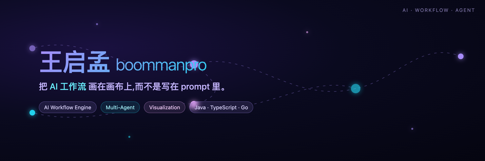

<!-- 部署说明:把此文件覆盖到 boommanpro/boommanpro 仓库的 README.md,并把 banner.png 一起上传到该仓库,然后下方的 ./banner.png 相对路径即可正常展示。Total Stars / Public Repos / Global Star Rank 为静态数字,Followers 为动态徽章;如需更新静态数字,可参考 https://gitstar-ranking.com/boommanpro 。 -->

  

<h1 align="center">王启孟 · Boomman</h1>

  <em>把 AI 工作流画在画布上,而不是写在 prompt 里。</em>

  
  
  
  

  
  
  

---

Java 老兵,现在在做 AI 工作流编排和多 Agent 协作的可视化工具。
相信复杂 AI 流程应该被设计、被编排、被复用——而不是每次重新对话一遍。

### 我在做什么

**[Gaia Workflow Engine](https://github.com/boommanpro/gaia-workflow-engine)** · 把 AI 工作流搬上无限画布
在无限画布上设计、测试、部署 AI 流程,无需写代码。结合 flowgram.ai 的能力与 Java 服务端,提供生产级工作流管理。

**[Paddle Copy](https://github.com/boommanpro/paddle-copy)** · 图片文字一秒复制
基于 Paddle OCR 的本地服务,微信图片识别复制效果。

**[json4u](https://github.com/boommanpro/json4u) / [xml4u](https://github.com/boommanpro/xml4u)** · 把结构化数据看清楚
JSON / XML 可视化工具——数据多了之后,人眼需要画布。

### 我相信的几件事

**AI 工作流是新的"代码"。** Prompt 是一次性的,工作流是可复用的。值得花时间把一次性的对话沉淀成可编排的流程。

**可视化是 AI 落地的最后一公里。** Agent 在黑盒里跑,没人敢用。把每个节点、每次工具调用、每条 memory 摊开,信任才会发生。

**Java 老兵在 AI 时代不缺位。** 工程化、稳定性、生产级——这些 AI 产品同样需要,而老程序员最懂。

### 一年的活动

  

### 技术栈

  
  
  
  
  
  
  

### 找到我

- 坐标:北京 · 昌平
- 博客:[boommanpro.cn](https://boommanpro.cn/)
- 邮箱:[boommanpro@gmail.com](mailto:boommanpro@gmail.com)

---

  下一个项目:让 AI Agent 自己画工作流。

